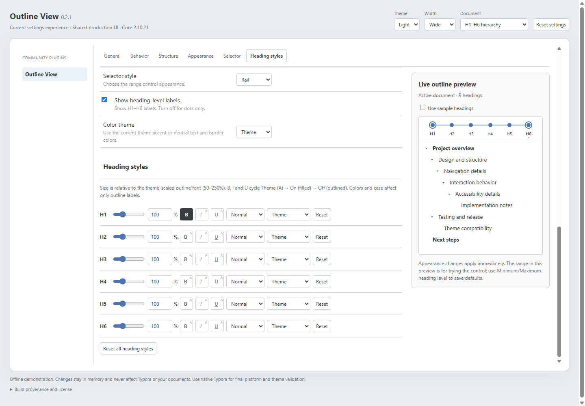

# Outline View for Typora

Keep **Files on the left and your document outline on the right**. Outline View
is an independent, synchronized heading navigator for
[Typora Community Plugin](https://github.com/typora-community-plugin/typora-community-plugin).
It does not replace or move Typora's native outline.

**Release:** [0.3.0](https://github.com/prisant-labs/typora-plugin-outline-view/releases/tag/0.3.0)
is available for installation. Outline View is listed in the Community Plugin marketplace.
The maintainer reported successful Windows/macOS testing of the development
candidate; see the [validation record](docs/release/NATIVE-CHECKLIST.md) for its
scope and the subsequent automated regression fixes.

The repository is preparing an unreleased 0.3.1 candidate for the compact
settings masthead. See the [draft notes](docs/release/0.3.1.md); use the 0.3.0
release asset for an installed stable version.

See the [0.3.0 release notes](docs/release/0.3.0.md) for the new appearance and
browsing options.

## Features

- Live H1-H6 outline, click navigation, active-heading following, collapsible branches.
- Heading ranges such as H2-H4 using drag, click, or keyboard controls.
- Rail, Enclosure, or Bracket selectors; labels/dots; Theme/Grayscale; or hide the selector.
- Per-rank size (50-250%), bold/italic/underline, ALL CAPS/Small Caps, theme/custom colors.
- Live settings preview, compact controls, and sticky section navigation.
- Optional collapse icon styles, vertical guides, alternating row colors, and
  section spacing/dividers with theme or custom light/dark colors.
- Optional active-path emphasis, clickable current path, and current-branch focus.
- Presentation changes never modify document text.

## Preview the settings

Download [the self-contained settings prototype](docs/prototype/settings.html)
and open it in a browser. It uses production UI with synthetic headings and
in-memory settings, and works offline. GitHub's file viewer shows HTML source;
download the file to interact. [How it stays current](docs/prototype/README.md).



*0.2.1 browser prototype screenshot. Open the generated HTML above for current
settings. Maintainer-confirmed native
validation is recorded separately from browser and CI coverage.*

## Requirements

- Typora with [Community Plugin installed](https://github.com/typora-community-plugin/typora-community-plugin).
- Community Plugin **2.10.21** is the pinned test baseline and declared minimum.
- The manifest declares Typora **1.4.0** as its minimum; that oldest version has
  not been independently certified. Use a current Typora release and consult the
  [native validation checklist](docs/release/NATIVE-CHECKLIST.md).
- Windows and macOS are supported platforms. Linux runtime support is not yet
  advertised; Linux CI checks build tools, not native Typora compatibility.

## Installation

### Marketplace

In Community Plugin settings, open **Marketplace**, search for **Outline View**,
install it, then enable it under **Installed Plugins**.

### Manual installation or candidate testing

Download [plugin.zip from release 0.3.0](https://github.com/prisant-labs/typora-plugin-outline-view/releases/download/0.3.0/plugin.zip).
GitHub's automatic source-code ZIPs are not plugin packages. The release includes
a SHA-256 checksum for verifying the downloaded archive.

1. Close Typora. Back up an existing Outline View plugin folder before upgrading.
2. Extract `plugin.zip` directly into one of these locations:

   | Scope | Location |
   | --- | --- |
   | Vault-local, any platform | `<vault>/.typora/plugins/prisant-labs.outline-view/` |
   | Windows global | `%USERPROFILE%\.typora\community-plugins\plugins\prisant-labs.outline-view\` |
   | macOS global | `~/.typora/community-plugins/plugins/prisant-labs.outline-view/` |

3. Ensure `main.js`, `manifest.json`, `style.css`, `LICENSE.md`, and
   `THIRD-PARTY-NOTICES.md` are directly inside that folder, without an extra
   nested `dist/` or `plugin/` directory.
4. Reopen Typora and enable **Outline View** under **Installed Plugins**.

These are default Community Plugin paths; a custom plugin directory overrides
them. Avoid duplicate global/vault copies while testing.

## Quick start

Open a Markdown document and keep Files visible. In the F1 command palette, run
**Outline View: Toggle**. Click a heading to navigate. The outline's gear opens
**Community Plugins > Outline View** settings.
The icon immediately to its left shows the current word-wrap mode: a returning
arrow for wrapped lines, straight lines for no wrapping. Click it to switch;
this saves the same preference as **Wrap long heading labels** in settings.

Commands: **Toggle**, **Refresh**, **Expand All**, and **Collapse All**, each
prefixed with **Outline View:**.

### Heading range and appearance

Drag either endpoint, or click an endpoint and then a heading level. Keyboard
users can focus an endpoint and use arrows, Home, or End; Escape cancels an armed
selection. Start never exceeds end, and equal endpoints show a single rank.
Ranges are remembered per document for the session; Minimum/Maximum settings
define saved defaults. The preview range is only for trying the control.
**Use samples** shows a 57-heading hierarchy with `h1.`-`h6.` prefixes, long
labels, repeated labels, and skipped levels. The standalone prototype uses the
same hierarchy. Prefixes are sample text only, never added to your document.

Bold/italic/underline are **On/Off** toggles: selected buttons have inverse
contrast; unselected buttons disable that emphasis. Older Theme emphasis values
become Off; existing On/Off choices are retained. The color swatch only appears
with **Custom color**, and Theme color still follows the current theme. Resets
restore defaults with emphasis Off. A row fill and fine outline use the theme's
active-file background and border colors to identify the current heading without
changing its selected text color, font weight, or other styles. Keyboard focus
remains separately visible on the focused control.

## Troubleshooting and limitations

- No outline? Confirm the plugin is enabled, the core version meets the minimum,
  and the document has headings. Run **Outline View: Refresh**.
- Source mode does not support live parsing/navigation and may retain the last
  parsed outline. Return to rendered editing mode and refresh before navigating.
- The dock is the only supported placement. This plugin does not rewrite or
  reorder document sections.
- Per-document ranges and collapse state are session-only, not persistent
  Markdown metadata.
- Theme variables, installed fonts, and OS color pickers affect appearance.
  Browser preview coverage does not guarantee every Typora theme.
- To revert an update, disable the plugin, close Typora, and restore the backed-up
  plugin folder. Back up settings before downgrading; older versions may not
  understand newer appearance settings.

Report reproducible issues with plugin/core/Typora versions, OS, theme, and a
synthetic Markdown example. Remove private text and paths from diagnostics.
For vulnerabilities, follow [SECURITY.md](SECURITY.md).

## Development

Use Node.js 22 and pnpm 10.33.4 (pinned in `package.json`).

```sh
pnpm install --frozen-lockfile
pnpm test:run
pnpm typecheck
pnpm run pack
pnpm release:check
pnpm prototype:check
```

After UI/source/dependency changes, run `pnpm prototype:build` and include the
generated HTML. CI verifies freshness and validates release ZIP contents on
Linux and Windows. Use **`pnpm run pack`**, not pnpm's built-in tarball command.
The optional `plugin_typora-outline-view.zip` is byte-identical to `plugin.zip`;
the marketplace requires the latter name.

The package's `private: true` prevents accidental npm publication; it does not
control GitHub visibility or marketplace distribution.

See [contributing](CONTRIBUTING.md), [architecture](docs/ARCHITECTURE.md),
[test plan](docs/TEST-PLAN.md), [release runbook](docs/MARKETPLACE-RELEASE.md),
[0.2.1 notes](docs/release/0.2.1.md), and [changelog](CHANGELOG.md).

## Credits and license

Built for Typora Community Plugin. Inspired by the Files + Outline experience
of [obgnail's right_outline](https://github.com/obgnail/typora_plugin), with an
independent implementation using Community Plugin's workspace APIs.

[MIT](LICENSE.md), copyright 2026 Prisant Labs.
[Third-party notices](THIRD-PARTY-NOTICES.md) accompany the release package.
